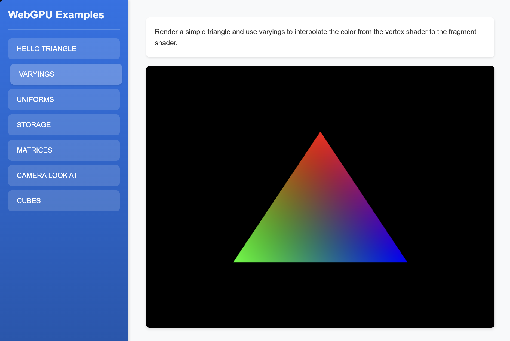

# WebGPU Examples

This project demonstrates various WebGPU examples implemented in TypeScript, featuring an interactive UI to switch between different demos.



## Available Demos

1. Triangle - The hello world of WebGPU. A simple triangle. [Learn more](src/examples/01-triangle/basic-triangle.md)
2. Varyings - Render a simple triangle and use varyings to interpolate the color from the vertex shader to the fragment shader. [Learn more](src/examples/02-triangle-varyings/shader-interpolation.md)
3. Uniforms - Render a simple triangle and use uniforms to dynamically control its color, position, and size in the shader. [Learn more](src/examples/03-triangle-uniforms/uniform-variables.md)
4. Storage - This is a simple example of how to use storage buffers to store data in the GPU and update them in the shader. [Learn more](src/examples/04-triangles-storage/storage-buffers.md)
5. Matrices - Render multiple triangles with projection, view and model matrices. [Learn more](src/examples/05-triangles-matrices/matrix-transforms.md)
6. Camera look at - Render multiple triangles with a camera that can be controlled using the mouse. This "look at" camera is simple and intuitive, making it useful for focusing on a specific object in the scene, even if it is not the most versatile camera type. [Learn more](src/examples/06-triangles-camera-look-at/camera-setup.md)
7. Cube - Render a cube loaded from a .obj file. [Learn more](src/examples/07-cube/3d-rendering.md)
8. Directional Lighting - Render multiple 3D objects with directional lighting, demonstrating light direction, color, and normal calculations. [Learn more](src/examples/08-lights-directional/ligths-directional.md)

## Setup 🛠️

1. Install dependencies:
```bash
npm install
```

2. Start the development server:
```bash
npm run dev
```

3. Open your browser and navigate to the URL shown in the terminal (usually `http://localhost:5173`)

## Project Structure 📁

- `src/main.ts` - Main application entry point and UI initialization
- `src/examples/` - Individual WebGPU demo implementations
- `src/styles.css` - Application styles
- `index.html` - HTML entry point
- `vite.config.ts` - Vite configuration
- `tsconfig.json` - TypeScript configuration

## Features ✨

- Interactive UI with buttons to switch between different demos
- Error handling and display for WebGPU initialization failures
- Modular demo structure for easy addition of new examples

## Notes 📝

Each demo is implemented as a separate module, making it easy to add new examples or modify existing ones. The project uses a clean architecture that separates the demo implementations from the main application logic.

## Internal documentation 📚

- [Basic Triangle (basic-triangle.md)](src/examples/01-triangle/basic-triangle.md)
- [Shader Interpolation (shader-interpolation.md)](src/examples/02-triangle-varyings/shader-interpolation.md)
- [Uniform Variables (uniform-variables.md)](src/examples/03-triangle-uniforms/uniform-variables.md)
- [Storage Buffers (storage-buffers.md)](src/examples/04-triangles-storage/storage-buffers.md)
- [Matrix Transforms (matrix-transforms.md)](src/examples/05-triangles-matrices/matrix-transforms.md)
- [Camera Setup (camera-setup.md)](src/examples/06-triangles-camera-look-at/camera-setup.md)
- [3D Rendering (3d-rendering.md)](src/examples/07-cube/3d-rendering.md)
- [Directional Lighting (ligths-directional.md)](src/examples/08-lights-directional/ligths-directional.md)
- [Cameras (camera.md)](src/libs/camera/camera.md)

## References and thanks 🚀

- [WebGPU Fundamentals](https://webgpufundamentals.org/webgpu/lessons/webgpu-bind-group-layouts.html)
- [WebGPU Best Practices](https://toji.dev/webgpu-best-practices/bind-groups)
- [Cameras Theory in WebGPU](https://carmencincotti.com/2022-04-25/cameras-theory-webgpu)

## License ⚖️

This project is licensed under the MIT License - see the [LICENSE.md](LICENSE.md) file for details