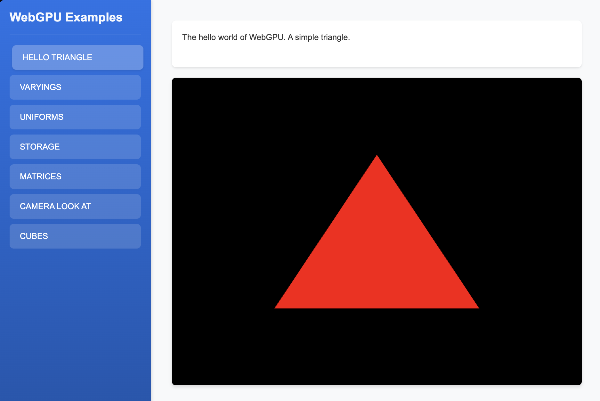

# Basic Triangle Example

This example demonstrates the fundamental concepts of WebGPU by rendering a simple triangle. It covers:

- Setting up a WebGPU device and context
- Creating and using a basic vertex shader
- Creating and using a basic fragment shader
- Defining vertex data for a triangle
- Basic rendering pipeline setup

This serves as the foundation for more complex WebGPU examples that follow. 

