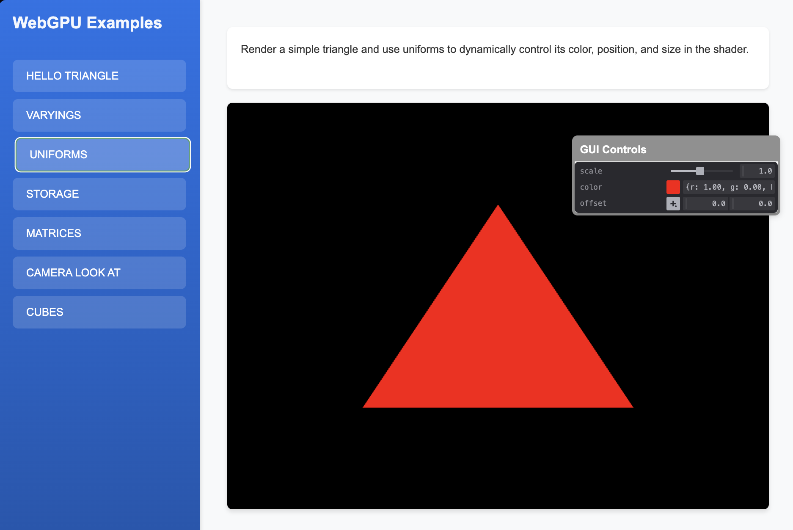

# Triangle with Uniforms Example

This example introduces uniform buffers in WebGPU, demonstrating how to pass dynamic data to shaders. It covers:

- Creating and using uniform buffers
- Updating uniform values from JavaScript
- Using uniforms in shaders
- Dynamic updates to shader parameters
- Time-based animations

This example illustrates how to create dynamic effects using uniform buffers to pass data to shaders. 