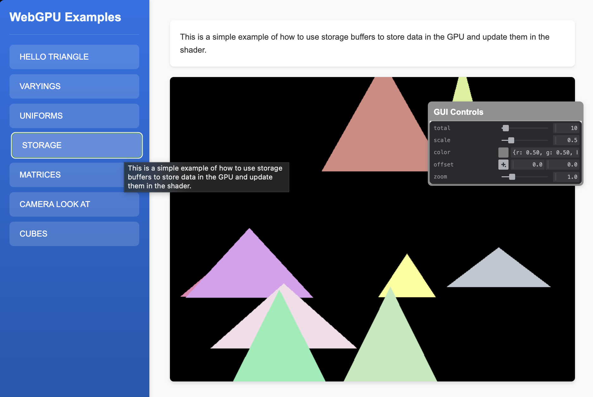

# Triangles with Storage Buffers Example

This example demonstrates the use of storage buffers in WebGPU for handling multiple triangles. It covers:

- Creating and managing storage buffers
- Handling multiple objects in a single draw call
- Dynamic data storage and updates
- Efficient memory management
- Instance-based rendering

This example shows how to efficiently render multiple objects using storage buffers and instance-based techniques. 