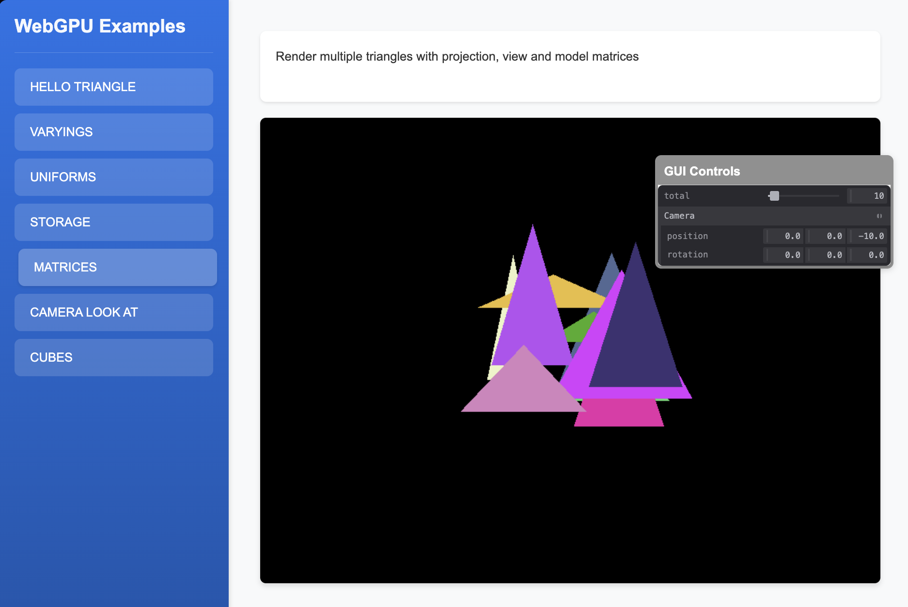

# Triangles with Matrices Example

This example introduces matrix transformations in WebGPU for handling object transformations. It covers:

- Implementation of matrix mathematics
- Object transformation using matrices
- Rotation, scaling, and translation
- Combining multiple transformations
- Matrix uniform buffer usage

This example demonstrates how to use matrices to transform objects in 3D space, providing the foundation for more complex 3D graphics. 