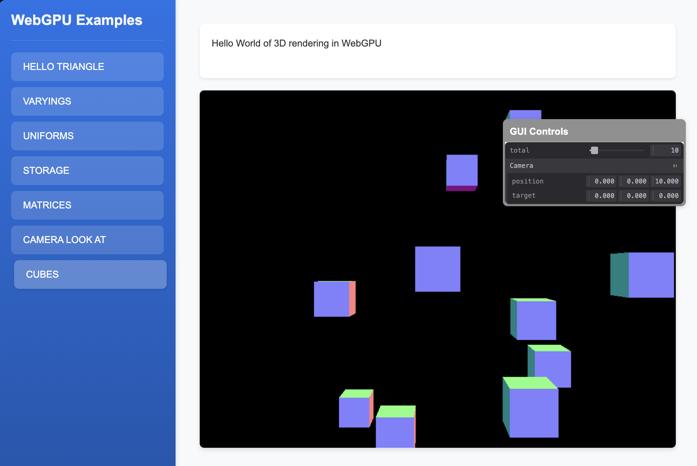

# 3D Cubes Example

This example is the Hello World of 3D rendering in WebGPU. It demonstrates how to create and render a 3D cube in WebGPU. It covers:

- 3D geometry creation
- Vertices and Normals buffers for 3D objects
- Depth testing and face culling
- 3D transformations with matrices
- Lighting passing the model with its normals
- Model buffer manager to update the model data

This example brings together previous concepts to create a complete 3D rendering pipeline, demonstrating how to render and manipulate 3D objects in WebGPU.