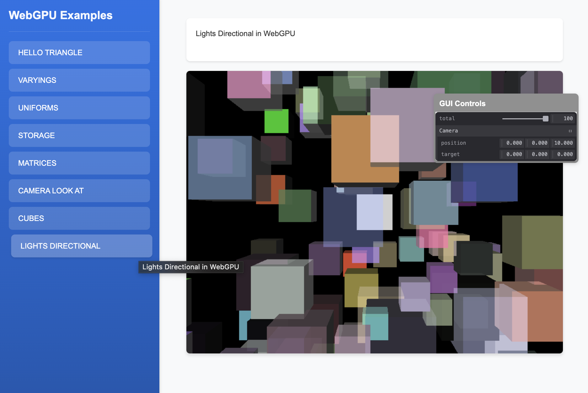

# Directional Lighting Example

This example demonstrates basic 3D rendering with directional lighting in WebGPU. It covers:

- Multiple 3D object instantiation and rendering
- Directional lighting implementation with light direction and color
- Dynamic object positioning in 3D space
- Color randomization for visual variety
- Advanced buffer management with separate global and model buffers
- Camera controls with look-at functionality
- Depth testing and face culling
- Vertex and normal buffer handling for lighting calculations

This example showcases how to implement a basic 3D rendering system with directional lighting, demonstrating practical techniques for creating 3D scenes in WebGPU.